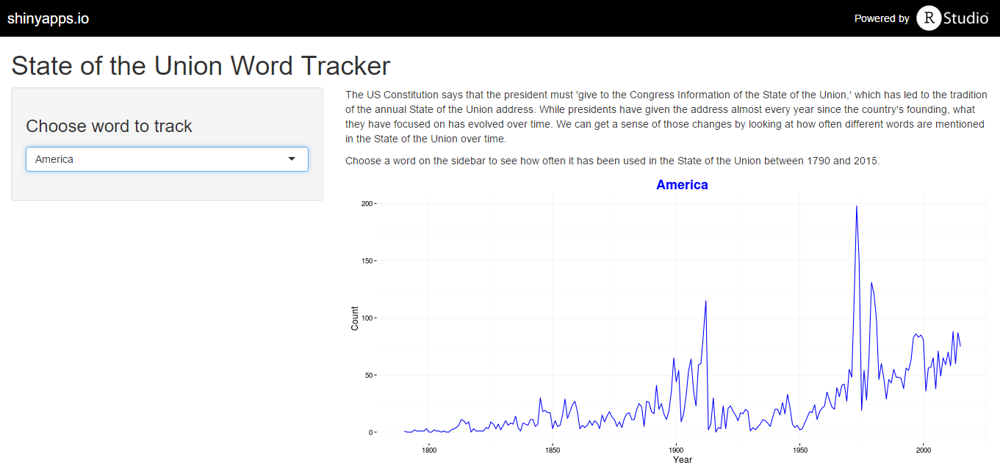

## State of the Union Word Tracker

The [Shiny app](https://jchaskell.shinyapps.io/SOTU) graphs the prevalence of 31 words in State of the Union speeches over time:
* The dropdown menu on the sidebar allows users to choose which word they want to track
* The main panel then graphs how often that word (or a very similar word) appears in State of the Union speeches between 1790-2015
* The user interface looks like this:



--- .class #id 

## Prepping the Data
* I took the text of the SOTU speeches from [The Presidency Project](http://www.presidency.ucsb.edu/sou.php)
* I counted the number of times 31 different words that are relevant to the American political conversation appear in the speeches
- Example -- counting "American"" from 2010 - 2015:

```r
library(stringr)
load("speeches.RData")
recent <- sp[which(sp$year >= 2010),] #subsets to only include 2010-2015
recent$speech <- tolower(recent$speech) #puts speech in all lower case
str_count(recent$speech, "god") #counts instances of "god" in each speech
```

```
## [1] 2 2 2 3 3 2
```
* I created a data frame that includes these counts for all 31 words and could then be used for the Shiny app
* See [Github](https://github.com/jchaskell/SOTU) for the detailed code for the entire process


---
## Graphing the Data
Users can select the word they want to track and the graph will display on the main panel.

The code for graphing counts of the word "God" is here:

```r
ggplot(sotu, aes(x = year, y = God)) + geom_line(color = "blue", lwd = 0.5) + ggtitle("God") + 
        xlab("Year") + ylab("Count") + theme_bw() +
        theme(panel.background = element_blank(), axis.title = element_text(size = 12))
```

 

--- 
## Future Extensions

There are a number of possible extensions that could be added in the future:
* Allow users to compare the trends for two different words
* Allow users to search for any word of their choosing

For now, have fun!

 


