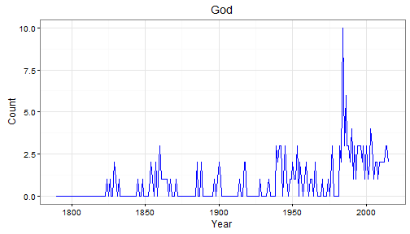

## State of the Union Word Tracker
Interested in tracking how American political rhetoric has changed over time?

Use the [State of the Union Word Tracker Shiny App](https://jchaskell.shinyapps.io/SOTU)!

Functions:
* Tracks word use in the president's annual State of the Union address
* Easily choose which word to track (from a set of choices) on the sidebar dropdown menu
* Graph updates with the choice of a word and plots how often that word (or a very similar word) appears in State of the Union speeches between 1790 and 2015
* Graphs fit with our understanding of political history: "slavery"" common in the mid-1800s, "Communism"" common in the 1950s, and "war" before and during war


--- .class #id 

## How the Data was Built
* I took the text of the State of the Union speeches from [The Presidency Project](http://www.presidency.ucsb.edu/sou.php)
* I counted the number of times 31 different words that are relevant to the American political conversation appear in the speeches
- Example -- counting "America/American" from 2010 - 2015:

```r
recent <- sp[which(sp$year >= 2010),] #subsets to only include 2010-2015
recent$speech <- tolower(recent$speech) #puts speech in all lower case
str_count(recent$speech, "america") #counts instances of "america/american" in each speech
```

```
## [1] 70 58 88 60 87 75
```
* I created a data frame that includes these counts for all 31 words and could then be used for the Shiny app
* See [Github](https://github.com/jchaskell/SOTU/tree/gh-pages) for the detailed code for the entire process


---
## Graphing the Data
Users can select the word they want to track from a list of 31 choices and the graph will display on the main panel.

The code for graphing counts of the word "God" is here:

```r
ggplot(sotu, aes(x = year, y = God)) + geom_line(color = "blue", lwd = 0.5) + ggtitle("God") + 
        xlab("Year") + ylab("Count") + theme_bw() +
        theme(panel.background = element_blank(), axis.title = element_text(size = 12))
```

 

--- 
## Future Extensions

There are a number of possible extensions that could be added in the future:
* Allow users to compare the trends for two different words
* Allow users to search for any word of their choosing

For now, have fun!

 


